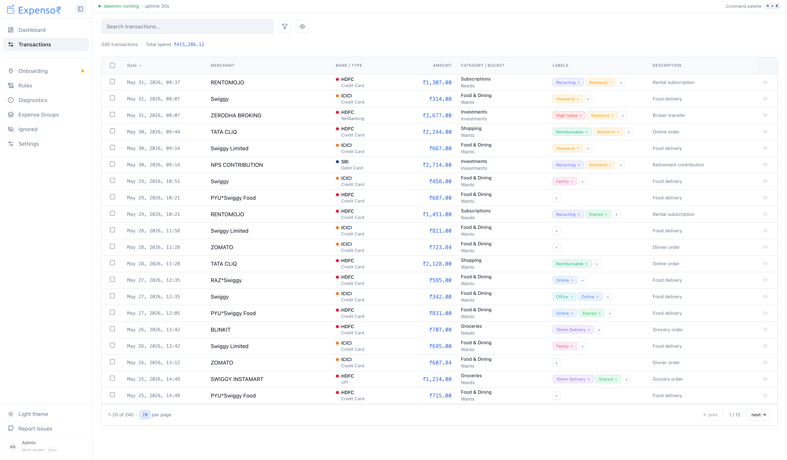
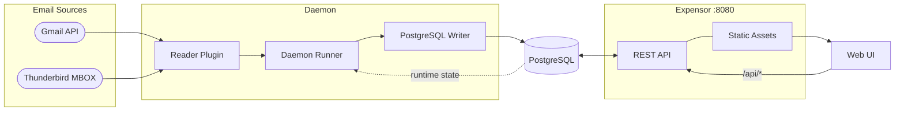

<h1 align="center">Expensor</h1>

<p align="center">
  Email-driven personal finance tracking with PostgreSQL-backed transaction analytics.
</p>

<p align="center">
  <a href="#quick-start">Quick Start</a> ·
  <a href="https://kanishk.io/posts/expensor/">Read the Blog Post</a> ·
  <a href="https://github.com/ArionMiles/expensor/releases">Releases</a>
</p>

<p align="center">
  
</p>

More screenshots are available in [`docs/screenshots`](docs/screenshots/).

Expensor reads expense-related emails from Gmail or Thunderbird, extracts transaction details with configurable rules, and stores them in PostgreSQL. It ships with a web UI for onboarding, dashboard analytics, transaction review, labels, settings, and daemon control.

> [!IMPORTANT]
> This project is built with AI-assisted tooling.

## Quick Start

The fastest way to run Expensor is Docker Compose. It starts Expensor and PostgreSQL, then you finish setup in the browser.

```bash
# Download the Docker Compose file
curl -LO https://raw.githubusercontent.com/ArionMiles/expensor/refs/heads/main/deploy/docker-compose.yml

# Generate and export the encryption key used for reader credentials and OAuth tokens
export EXPENSOR_SECRET_KEY="$(openssl rand -base64 32)"

# Start the services
docker compose up -d
```

Open `http://localhost:8080` and follow the onboarding wizard.

This starts:

- Expensor UI and API on port `8080`
- PostgreSQL on the internal Compose network
- A persistent `postgres_data` volume containing transactions, settings, reader config, OAuth tokens, and processed-message state

### Encryption Secret

Expensor encrypts reader client secrets and OAuth tokens before storing them in PostgreSQL. Set `EXPENSOR_SECRET_KEY` before starting the app and back it up; if it is lost, stored reader credentials cannot be decrypted and readers must be reconnected.

For one-off shell usage:

```bash
export EXPENSOR_SECRET_KEY="$(openssl rand -base64 32)"
docker compose up -d
```

For a persistent Compose setup, create a `.env` file next to `docker-compose.yml`:

```dotenv
EXPENSOR_SECRET_KEY=base64-encoded-key-here
```

If you are running from a cloned repository, `task secrets:generate` prints a valid base64-encoded 32-byte key. See [docs/deployment/secrets.md](docs/deployment/secrets.md) for file-based secret configuration and backup guidance.

### Custom PostgreSQL Password

The Compose file uses a default local password for convenience. To set your own password for a new stack:

```bash
EXPENSOR_POSTGRES_PASSWORD='change-me' docker compose up -d
```

You can also create a `.env` file next to `docker-compose.yml`:

```dotenv
EXPENSOR_SECRET_KEY=base64-encoded-key-here
EXPENSOR_POSTGRES_PASSWORD=change-me
```

Then run:

```bash
docker compose up -d
```

For an existing database volume, change the password inside PostgreSQL before changing the Compose environment. The official Postgres image only uses `POSTGRES_PASSWORD` when initializing a new database directory.

### Thunderbird

For Thunderbird, mount your profile directory read-only and set `THUNDERBIRD_DATA_DIR` to the mount point if discovery needs a hint:

```yaml
services:
  expensor:
    environment:
      THUNDERBIRD_DATA_DIR: /thunderbird-profile
    volumes:
      - /path/to/Thunderbird/Profiles/your.profile:/thunderbird-profile:ro
```

The onboarding wizard can then discover the mounted profile and save the selected profile/mailboxes in PostgreSQL.

## Features

- Gmail API and Thunderbird MBOX readers
- Web onboarding for reader selection, credentials upload, OAuth, and reader config
- PostgreSQL-backed transactions, settings, rules, labels, runtime state, and dedup state
- Dashboard summaries, charts, heatmaps, and transaction drill-downs
- Transaction search, filters, labeling, muting, and edit flows
- Predefined extraction rules plus user-managed rules in the UI
- Backup/restore, diagnostics, OpenAPI contract checks, component tests, and Playwright smoke coverage

## How It Works

1. Open the web UI and complete onboarding.
2. Start the daemon from the UI.
3. Expensor polls Gmail or Thunderbird on the configured interval.
4. Messages are matched against predefined and user-managed rules.
5. Regex extractors derive amount, currency, merchant, date, and source.
6. Transactions and processing state are written to PostgreSQL.
7. The UI reads from the API for dashboard, transaction, settings, labels, and rules workflows.

## Architecture



## Configuration

Most setup happens in the web UI. Environment variables are only needed for deployment wiring and a few runtime defaults.

| Variable | Use |
|----------|-----|
| `BASE_URL` | Public URL used for OAuth redirects. Set this if Expensor is not reached at `http://localhost:8080`. |
| `FRONTEND_URL` | Post-auth redirect target. Usually leave unset unless running the Vite dev server separately. |
| `EXPENSOR_DB_BACKEND` | Database backend. Set to `postgres` for PostgreSQL deployments. |
| `POSTGRES_HOST` | PostgreSQL host. Required outside the bundled Compose setup. |
| `POSTGRES_DB` | PostgreSQL database name. |
| `POSTGRES_USER` | PostgreSQL user. |
| `POSTGRES_PASSWORD` | PostgreSQL password. |
| `POSTGRES_PORT` | PostgreSQL port. Defaults to `5432`. |
| `POSTGRES_SSLMODE` | PostgreSQL SSL mode. Defaults to `disable`. |
| `EXPENSOR_SECRET_KEY` | Base64-encoded 32-byte key used to encrypt reader client secrets and OAuth tokens. Required unless `EXPENSOR_SECRET_KEY_FILE` is set. |
| `EXPENSOR_SECRET_KEY_FILE` | Path to a file containing the base64-encoded encryption key. Required unless `EXPENSOR_SECRET_KEY` is set. |
| `LOG_LEVEL` | Minimum log level: `DEBUG`, `INFO`, `WARN`, or `ERROR`. Defaults to `INFO`. |
| `LOG_JSON` | Set to `true` for structured JSON logs. Defaults to `false`. |
| `EXPENSOR_OBSERVABILITY_ENABLED` | Enable OpenTelemetry traces and metrics. Defaults to `false`. |
| `EXPENSOR_OBSERVABILITY_EXPORTER` | Telemetry exporter. Supported values are `none` and `otlp`. |
| `EXPENSOR_OBSERVABILITY_OTLP_ENDPOINT` | OTLP gRPC collector endpoint. |
| `EXPENSOR_OBSERVABILITY_OTLP_INSECURE` | Set to `true` for an insecure OTLP gRPC connection. |

## Releases

| Channel | Image | Updated |
|---------|-------|---------|
| Stable | `ghcr.io/arionmiles/expensor:<version>` | On git tag push |
| Tip | `ghcr.io/arionmiles/expensor:tip` | On every merge to `main` |

Tip builds are also published with a pinnable tag: `ghcr.io/arionmiles/expensor:tip-<sha7>`.

Latest release: see [Releases](https://github.com/ArionMiles/expensor/releases).

## Contributing

Repository structure, local development commands, testing guidance, internationalization notes, and contribution workflow live in [CONTRIBUTING.md](.github/CONTRIBUTING.md).

## Third-Party Notices

The Gmail and Thunderbird icons used in this project are trademarks of their respective owners, Google LLC and MZLA Technologies Corporation. They are used solely to identify the services Expensor integrates with. See [NOTICE](NOTICE) for full attribution.
