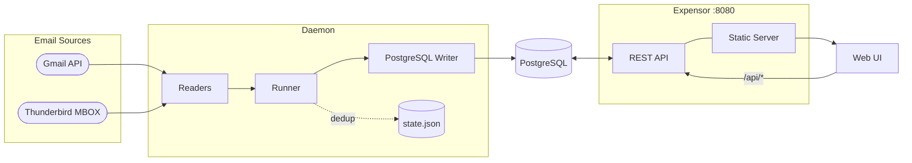

# expensor

> [!IMPORTANT]
> This project is built with AI-assisted tooling.

Expensor reads expense-related emails from your inbox, extracts transaction details, and writes them to PostgreSQL. It ships with a web UI for setup, monitoring, and transaction management.

I've documented why exactly expensor works for me [on my blog](https://kanishk.io/posts/expensor/). The rules are dead-simple regex extractions which are fast and can be updated easily.

## How does it work?

1. Open the web UI and complete the onboarding wizard (select reader, upload credentials, authenticate)
2. Start the daemon — it periodically polls the configured inbox (Gmail or Thunderbird)
3. Match emails against [rules](backend/cmd/server/content/rules.json) by sender and/or subject
4. Extract transaction details — amount, merchant name, date — via regex
5. Write them to PostgreSQL
6. Browse, filter, search, and label transactions in the Transactions view

## Architecture



## Repository Structure

```
.
├── backend/
│   ├── cmd/server/          # Main server binary
│   │   └── content/         # Embedded rules.json & labels.json
│   ├── internal/
│   │   ├── api/             # HTTP handlers, routing, middleware
│   │   ├── daemon/          # Reader → writer pipeline
│   │   ├── plugins/         # Plugin registry
│   │   └── store/           # PostgreSQL query layer
│   ├── migrations/          # SQL migrations (run automatically on startup)
│   └── pkg/
│       ├── api/             # Core interfaces & types (Reader, Writer, Rule)
│       ├── config/          # Environment-based configuration
│       ├── extractor/       # Amount & merchant regex extraction
│       ├── state/           # SHA-256 keyed dedup state
│       ├── reader/
│       │   ├── gmail/       # Gmail API reader
│       │   └── thunderbird/ # MBOX file reader
│       ├── writer/
│       │   └── postgres/    # PostgreSQL writer (batched)
│       └── plugins/         # Plugin wrappers for readers & writers
├── frontend/                # React + Vite + Tailwind web UI
├── tests/                   # Integration test helpers & local docker-compose
├── docker-compose.yml       # Default compose (gmail + postgres)
└── Taskfile.yml             # Build & dev automation
```

## Quick Start

Create a `docker-compose.yml` with the following content:

```yaml
services:
  postgres:
    image: postgres:16-alpine
    restart: unless-stopped
    environment:
      POSTGRES_DB: expensor
      POSTGRES_USER: expensor
      POSTGRES_PASSWORD: expensor_password
    volumes:
      - postgres_data:/var/lib/postgresql/data
    healthcheck:
      test: ["CMD-SHELL", "pg_isready -U expensor"]
      interval: 10s
      timeout: 5s
      retries: 5

  expensor:
    image: ghcr.io/arionmiles/expensor:v0.0.3
    restart: unless-stopped
    depends_on:
      postgres:
        condition: service_healthy
    ports:
      - "8080:8080"
    environment:
      POSTGRES_HOST: postgres
      POSTGRES_PORT: 5432
      POSTGRES_DB: expensor
      POSTGRES_USER: expensor
      POSTGRES_PASSWORD: expensor_password
      POSTGRES_SSLMODE: disable
      # BASE_URL: http://your-server-ip:8080  # set this when hosting on a local network
    volumes:
      - ./data:/app/data
      # Thunderbird only: uncomment and set path to your Thunderbird profile
      # - /path/to/Thunderbird/Profiles/your.profile:/thunderbird-profile:ro

volumes:
  postgres_data:
```

Then start the stack and open the onboarding wizard:

```bash
docker compose up -d
open http://localhost:8080   # or your server's IP/hostname
```

Your data (credentials, OAuth token, state) is persisted in `./data/`, created automatically on first run.

### Releases

| Channel | Image | Updated |
|---------|-------|---------|
| **Stable** | `ghcr.io/arionmiles/expensor:<version>` | On git tag push |
| **Nightly** | `ghcr.io/arionmiles/expensor:nightly` | Daily (if new commits) |

Latest release: see [Releases](https://github.com/ArionMiles/expensor/releases).

### Thunderbird

Uncomment the volume line in your `docker-compose.yml` and set the path to your Thunderbird profile directory:

```yaml
volumes:
  - ./data:/app/data
  - /path/to/Thunderbird/Profiles/your.profile:/thunderbird-profile:ro
```

The onboarding wizard will detect the mounted profile automatically.

## Configuration

All configuration is via environment variables. Reader and writer selection is handled through the web UI, not env vars.

### Core

| Variable | Default | Description |
|----------|---------|-------------|
| `EXPENSOR_DATA_DIR` | `data` | Directory for credentials, tokens, and state files |
| `EXPENSOR_STATE_FILE` | `data/state.json` | Path to dedup state file |
| `EXPENSOR_BASE_CURRENCY` | `INR` | Currency used for aggregate stats |

### Server

| Variable | Default | Description |
|----------|---------|-------------|
| `PORT` | `8080` | HTTP server port |
| `BASE_URL` | `http://localhost:8080` | Public base URL (used for OAuth redirect URI). Set to your server's address when hosting on a local network or remotely, e.g. `http://your-server-ip:8080` |
| `FRONTEND_URL` | same as `BASE_URL` | Post-auth redirect target. Override only for local development (e.g. `http://localhost:5173` when running the Vite dev server separately) |

### Gmail reader

Gmail credentials are uploaded and configured through the web UI onboarding wizard. No env vars are required.

### Thunderbird reader

| Variable | Default | Description |
|----------|---------|-------------|
| `THUNDERBIRD_DATA_DIR` | — | Extra path hint for profile discovery (Docker only). Set to the mount point if your profile is mounted at a non-default path. |

Profile path and mailboxes are configured through the web UI onboarding wizard.

### PostgreSQL

| Variable | Default | Description |
|----------|---------|-------------|
| `POSTGRES_HOST` | — | **Required.** Database host |
| `POSTGRES_DB` | — | **Required.** Database name |
| `POSTGRES_USER` | — | **Required.** Database user |
| `POSTGRES_PASSWORD` | — | Database password |
| `POSTGRES_PORT` | `5432` | Database port |
| `POSTGRES_SSLMODE` | `disable` | SSL mode |
| `POSTGRES_BATCH_SIZE` | `10` | Rows to buffer before flushing |
| `POSTGRES_FLUSH_INTERVAL` | `30` | Max seconds between flushes |
| `POSTGRES_MAX_POOL_SIZE` | `10` | Connection pool size |

### Logging

| Variable | Default | Description |
|----------|---------|-------------|
| `LOG_LEVEL` | `INFO` | `DEBUG`, `INFO`, `WARN`, or `ERROR` |
| `LOG_JSON` | `false` | Emit structured JSON logs |

## Development

This project uses [Task](https://taskfile.dev) for automation.

```bash
task dev               # Start postgres + backend + frontend (full stack)
task run               # Backend only (loads tests/.env)
task run:frontend      # Frontend Vite dev server only

# Formatting — aggregate targets run both stacks
task fmt               # Format all (Go: gci + gofumpt; TS: prettier)
task fmt:be            # Format Go only
task fmt:fe            # Format frontend only (prettier)

# Linting — aggregate targets run both stacks
task lint              # Lint all (Go + TypeScript)
task lint:be           # Lint Go with local config
task lint:be:prod      # Lint Go with strict CI config
task lint:fe           # TypeScript type-check

# Testing
task test              # Run all tests
task test:be           # Go unit tests (integration tests require Docker)
task test:be:cover     # Go tests with coverage report

# Security audit — aggregate targets run both stacks
task audit             # Audit all (Go + npm)
task audit:be          # govulncheck on Go source
task audit:fe          # npm audit on production dependencies

task build:binary      # Build optimized binary → bin/expensor
task build:docker      # Build Docker image locally
task ci                # Full CI gate: strict lint + tests + TS check + npm audit

task db:start          # Start local dev postgres container
task db:stop           # Stop local dev postgres container
```

Integration tests (in `backend/internal/store/` and `backend/pkg/writer/postgres/`) spin up a real Postgres container via testcontainers. Run them with:

```bash
go test ./backend/internal/store/... ./backend/pkg/writer/postgres/...
```

Skip them in short mode: `go test -short ./...`

## Adding Rules

Rules live in [`backend/cmd/server/content/rules.json`](backend/cmd/server/content/rules.json). Each rule specifies a sender email, subject fragment, and regex patterns to extract amount and merchant:

```json
{
  "name": "ICICI Credit Card",
  "senderEmail": "credit-cards@icicibank.com",
  "subjectContains": "Alert",
  "amountRegex": "Rs\\.\\s?([\\d,]+\\.\\d{2})",
  "merchantInfoRegex": "at ([^.]+)\\.",
  "enabled": true
}
```

Both `senderEmail` and `subjectContains` can be specified — a rule matches only when **both** conditions are met. Either field can be omitted to match any sender or subject.

### Amount regex patterns

```
Rs\.\s*([\d,]+\.?\d*)       → Rs. 1,234.56
INR\s*([\d,]+\.?\d*)        → INR 500.00
₹\s*([\d,]+\.?\d*)          → ₹ 2,500
\$\s*([\d,]+\.?\d*)         → $ 99.99
```

### Merchant regex patterns

```
at\s+([A-Z0-9\s]+)          → at AMAZON INDIA
on\s+([A-Z\s]+)             → on SWIGGY
for\s+([A-Z\s]+)            → for UBER TRIP
to\s+([A-Z\s]+)             → to NETFLIX COM
```

Each pattern must have exactly one capture group. Test patterns at [regex101.com](https://regex101.com) with Go flavour selected.

## Expensor doesn't recognise transactions from my bank

Open an issue with the email body content and I'll take a look.

## Third-party notices

The Gmail and Thunderbird icons used in this project are trademarks of their
respective owners (Google LLC and MZLA Technologies Corporation). They are used
solely to identify the services Expensor integrates with. See [NOTICE](NOTICE)
for full attribution.
