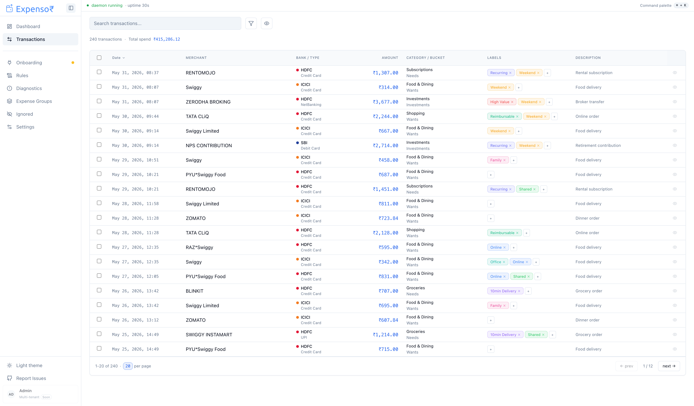
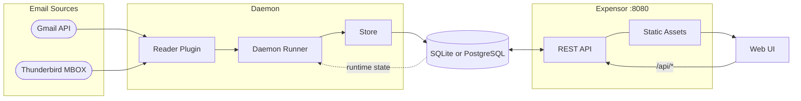

<h1 align="center">
  
</h1>

<p align="center">
  Email-driven personal finance tracking with a private SQLite database by default.
</p>

<p align="center">
  <a href="#quick-start">Quick Start</a> ·
  <a href="https://kanishk.io/posts/expensor/">Read the Blog Post</a> ·
  <a href="https://github.com/ArionMiles/expensor/releases">Releases</a>
</p>

<p align="center">
  
</p>

More screenshots are available in [`docs/screenshots`](docs/screenshots/).

Expensor reads expense-related emails from Gmail or Thunderbird and extracts transaction details with configurable rules. It uses SQLite by default and also supports PostgreSQL. The server includes the production web UI in one binary.

> [!IMPORTANT]
> This project is built with AI-assisted tooling.

## Quick Start

The fastest way to run Expensor is Docker Compose. The default deployment starts one Expensor service with a persistent SQLite database.

> [!WARNING]
> Releases before the SQLite default used PostgreSQL in `docker-compose.yml`. If you have an existing `postgres_data` volume, use `docker-compose.postgres.yml`. Do not start the new default file and assume that it migrated your data. Expensor does not automatically copy PostgreSQL data into SQLite.

```bash
# Download the Docker Compose file
curl -LO https://raw.githubusercontent.com/ArionMiles/expensor/refs/heads/main/deploy/docker-compose.yml

# Generate and export the encryption key used for reader credentials and OAuth tokens
export EXPENSOR_SECRET_KEY="$(openssl rand -base64 32)"

# Start the services
docker compose up -d
```

Open `http://localhost:8080` and follow the onboarding wizard.

This starts the UI and API on port `8080`. The `expensor_data` volume stores the SQLite database and all application state.

### Encryption Secret

Expensor encrypts reader secrets and OAuth tokens before storage. Back up `EXPENSOR_SECRET_KEY`. If you lose it, Expensor cannot decrypt saved reader credentials.

For one-off shell usage:

```bash
export EXPENSOR_SECRET_KEY="$(openssl rand -base64 32)"
docker compose up -d
```

For a persistent Compose setup, create a `.env` file next to `docker-compose.yml`:

```dotenv
EXPENSOR_SECRET_KEY=base64-encoded-key-here
```

If you are running from a cloned repository, `task secrets:generate` prints a valid base64-encoded 32-byte key.

### PostgreSQL Deployment

Use the explicit PostgreSQL Compose file when you need a separate database service:

```bash
curl -LO https://raw.githubusercontent.com/ArionMiles/expensor/refs/heads/main/deploy/docker-compose.postgres.yml
export EXPENSOR_SECRET_KEY="$(openssl rand -base64 32)"
docker compose -f docker-compose.postgres.yml up -d
```

Set `EXPENSOR_POSTGRES_PASSWORD` before the first start to replace the local default password.

### Native Installation

Release archives support Linux and macOS on amd64 and arm64. The installer verifies the archive checksum and does not replace an existing key or configuration file.

```bash
VERSION=v0.2.6
curl -fsSLO "https://github.com/ArionMiles/expensor/releases/download/$VERSION/install.sh"
EXPENSOR_VERSION="$VERSION" sh install.sh
~/.local/bin/expensor
```

Replace the version with the required release. The installer creates configuration under `${XDG_CONFIG_HOME:-$HOME/.config}/expensor`. Every release also includes a checksum manifest for manual verification.

### SQLite Data And Backups

Native installations use these default database paths:

- Linux: `${XDG_DATA_HOME:-$HOME/.local/share}/expensor/expensor.db`
- macOS: `$HOME/Library/Application Support/Expensor/expensor.db`

Set `EXPENSOR_SQLITE_PATH` to use a different path. Stop Expensor before you copy the database, `-wal`, and `-shm` files for a backup. Back up the encryption key with the database.

SQLite is suitable for one Expensor process. Use PostgreSQL when several application processes must share one database or when external database operations are required.

### Thunderbird

For Thunderbird, mount your profile directory read-only and set `THUNDERBIRD_DATA_DIR` to the mount point if discovery needs a hint:

```yaml
services:
  expensor:
    environment:
      THUNDERBIRD_DATA_DIR: /thunderbird-profile
    volumes:
      - /path/to/Thunderbird/Profiles/your.profile:/thunderbird-profile:ro
```

The onboarding wizard can then discover the mounted profile and save the selected profile and mailboxes.

## Features

- Gmail API and Thunderbird MBOX readers
- Web onboarding for reader selection, credentials upload, OAuth, and reader config
- SQLite storage by default, with PostgreSQL as an explicit option
- Dashboard summaries, charts, heatmaps, and transaction drill-downs
- Transaction search, filters, labeling, muting, and edit flows
- Predefined extraction rules plus user-managed rules in the UI
- Backup/restore, diagnostics, OpenAPI contract checks, component tests, and Playwright smoke coverage

## How It Works

1. Open the web UI and complete onboarding.
2. Start the daemon from the UI.
3. Expensor polls Gmail or Thunderbird on the configured interval.
4. Messages are matched against predefined and user-managed rules.
5. Regex extractors derive amount, currency, merchant, date, and source.
6. Transactions and processing state are written to the selected database.
7. The UI reads from the API for dashboard, transaction, settings, labels, and rules workflows.

## Architecture


```mermaid
flowchart LR
    subgraph Sources["Email Sources"]
        Gmail([Gmail API])
        TB([Thunderbird MBOX])
    end

    subgraph Daemon
        direction TB
        Reader[Reader Plugin] --> Runner[Daemon Runner] --> Writer[Store]
    end

    subgraph App["Expensor :8080"]
        direction TB
        API[REST API] --- Static[Static Assets]
    end

    Gmail --> Reader
    TB --> Reader
    Writer --> DB[(SQLite or PostgreSQL)]
    DB <--> API
    DB -. runtime state .-> Runner
    Static --> UI[Web UI]
    UI -- /api/* --> API
```

## Configuration

Most setup happens in the web UI. Environment variables are only needed for deployment wiring and a few runtime defaults.

| Variable | Use |
|----------|-----|
| `BASE_URL` | Public URL used for OAuth redirects. Set this if Expensor is not reached at `http://localhost:8080`. |
| `FRONTEND_URL` | Post-auth redirect target. Usually leave unset unless running the Vite dev server separately. |
| `EXPENSOR_DB_BACKEND` | Database backend: `sqlite` or `postgres`. Empty values use SQLite. |
| `EXPENSOR_SQLITE_PATH` | SQLite database path. Empty values use the platform data directory. |
| `EXPENSOR_SQLITE_BUSY_TIMEOUT` | SQLite lock wait timeout. Defaults to `5s`. |
| `POSTGRES_HOST` | PostgreSQL host. Required outside the bundled Compose setup. |
| `POSTGRES_DB` | PostgreSQL database name. |
| `POSTGRES_USER` | PostgreSQL user. |
| `POSTGRES_PASSWORD` | PostgreSQL password. |
| `POSTGRES_PORT` | PostgreSQL port. Defaults to `5432`. |
| `POSTGRES_SSLMODE` | PostgreSQL SSL mode. Defaults to `disable`. |
| `EXPENSOR_SECRET_KEY` | Base64-encoded 32-byte key used to encrypt reader client secrets and OAuth tokens. Required unless `EXPENSOR_SECRET_KEY_FILE` is set. |
| `EXPENSOR_SECRET_KEY_FILE` | Path to a file containing the base64-encoded encryption key. Required unless `EXPENSOR_SECRET_KEY` is set. |
| `LOG_LEVEL` | Minimum log level: `DEBUG`, `INFO`, `WARN`, or `ERROR`. Defaults to `INFO`. |
| `LOG_JSON` | Set to `true` for structured JSON logs. Defaults to `false`. |
| `EXPENSOR_OBSERVABILITY_ENABLED` | Enable OpenTelemetry traces and metrics. Defaults to `false`. |
| `EXPENSOR_OBSERVABILITY_EXPORTER` | Telemetry exporter. Supported values are `none` and `otlp`. |
| `EXPENSOR_OBSERVABILITY_OTLP_ENDPOINT` | OTLP gRPC collector endpoint. |
| `EXPENSOR_OBSERVABILITY_OTLP_INSECURE` | Set to `true` for an insecure OTLP gRPC connection. |

## Releases

| Channel | Image | Updated |
|---------|-------|---------|
| Stable | `ghcr.io/arionmiles/expensor:<version>` | On git tag push |
| Tip | `ghcr.io/arionmiles/expensor:tip` | On every merge to `main` |

Tip builds are also published with a pinnable tag: `ghcr.io/arionmiles/expensor:tip-<sha7>`.

Each stable release also contains native archives for Linux and macOS, SHA-256 checksums, and `install.sh`. Latest release: see [Releases](https://github.com/ArionMiles/expensor/releases).

## Contributing

Repository structure, local development commands, testing guidance, internationalization notes, and contribution workflow live in [CONTRIBUTING.md](.github/CONTRIBUTING.md).

## Third-Party Notices

The Gmail and Thunderbird icons used in this project are trademarks of their respective owners, Google LLC and MZLA Technologies Corporation. They are used solely to identify the services Expensor integrates with. See [NOTICE](NOTICE) for full attribution.
