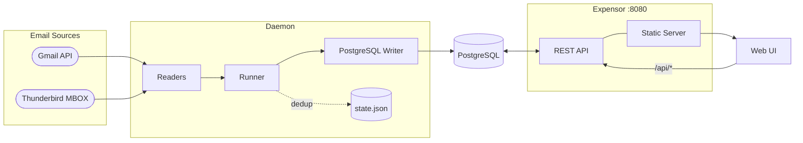

# Deployment & Release Overhaul Implementation Plan

> **For agentic workers:** REQUIRED SUB-SKILL: Use superpowers:subagent-driven-development (recommended) or superpowers:executing-plans to implement this plan task-by-task. Steps use checkbox (`- [ ]`) syntax for tracking.

**Goal:** Bundle the React frontend into the Go Docker image, unify docker-compose files, add a smart nightly CI release, and update the README with a Mermaid architecture diagram and one-command quick start.

**Architecture:** `NewServer` gains a `staticDir string` param; when non-empty it registers a SPA fallback handler after all `/api/...` routes. The Dockerfile gains a Node.js build stage that produces `frontend/dist/`, copied to `/app/public` in the runtime image. A single root `docker-compose.yml` replaces the three existing files. A new `nightly.yml` workflow runs daily, skipping if HEAD hasn't changed since the previous nightly tag.

**Tech Stack:** Go 1.23+, Node.js 22, Docker multi-stage, GitHub Actions, `docker/build-push-action`, `softprops/action-gh-release`.

---

## File Map

| File | Change |
|------|--------|
| `backend/internal/api/server.go` | Add `staticDir string` to `NewServer`; add `spaHandler` function |
| `backend/internal/api/server_test.go` | New — two tests for `spaHandler` |
| `backend/cmd/server/main.go` | Pass `EXPENSOR_STATIC_DIR` to `NewServer`; remove stale CMD pattern |
| `Dockerfile` | Add Node.js build stage; copy `frontend/dist` to `/app/public`; add `EXPOSE 8080`; add `ENV EXPENSOR_STATIC_DIR` |
| `docker-compose.yml` | Replace stale root file with unified reader-agnostic compose |
| `deployment/docker-compose.gmail-postgres.yml` | Delete |
| `deployment/docker-compose.thunderbird-postgres.yml` | Delete |
| `.github/workflows/nightly.yml` | New — nightly build workflow |
| `README.md` | Mermaid architecture diagram; one-command quick start; release table |

---

## Task 1: Backend — SPA static file handler

**Files:**
- Modify: `backend/internal/api/server.go`
- Create: `backend/internal/api/server_test.go`
- Modify: `backend/cmd/server/main.go`

### Background

Go's `net/http` ServeMux gives priority to more-specific patterns. All existing `/api/...` routes are registered as exact-prefix matches, so registering `"/"` as a catch-all is safe — it only fires for paths that don't match any `/api/...` pattern. `path.Clean("/" + r.URL.Path)` normalises URL paths and prevents directory traversal. `filepath.Join(dir, filepath.FromSlash(upath))` maps the cleaned URL path to a filesystem path; Go's `filepath.Join` never treats intermediate absolute components specially, so the result is always under `dir`.

When `EXPENSOR_STATIC_DIR` is empty (local dev), no handler is registered and Vite's proxy continues working unchanged.

- [ ] **Step 1: Write the two failing tests**

Create `backend/internal/api/server_test.go`:

```go
package api

import (
	"net/http"
	"net/http/httptest"
	"os"
	"path/filepath"
	"strings"
	"testing"
)

func TestSpaHandler_ServesExistingFile(t *testing.T) {
	dir := t.TempDir()
	if err := os.MkdirAll(filepath.Join(dir, "assets"), 0o700); err != nil {
		t.Fatal(err)
	}
	if err := os.WriteFile(filepath.Join(dir, "index.html"), []byte("<html>app</html>"), 0o600); err != nil {
		t.Fatal(err)
	}
	if err := os.WriteFile(filepath.Join(dir, "assets", "app.js"), []byte("// js"), 0o600); err != nil {
		t.Fatal(err)
	}

	h := spaHandler(dir)

	req := httptest.NewRequestWithContext(t.Context(), http.MethodGet, "/assets/app.js", nil)
	rr := httptest.NewRecorder()
	h(rr, req)

	if rr.Code != http.StatusOK {
		t.Errorf("expected 200 for existing file, got %d (body: %s)", rr.Code, rr.Body.String())
	}
}

func TestSpaHandler_FallsBackToIndexHTML(t *testing.T) {
	dir := t.TempDir()
	if err := os.WriteFile(filepath.Join(dir, "index.html"), []byte("<html>spa</html>"), 0o600); err != nil {
		t.Fatal(err)
	}

	h := spaHandler(dir)

	req := httptest.NewRequestWithContext(t.Context(), http.MethodGet, "/some/spa/route", nil)
	rr := httptest.NewRecorder()
	h(rr, req)

	if rr.Code != http.StatusOK {
		t.Errorf("expected 200 for SPA fallback, got %d (body: %s)", rr.Code, rr.Body.String())
	}
	if !strings.Contains(rr.Body.String(), "<html>spa</html>") {
		t.Errorf("expected index.html content in SPA fallback, got: %s", rr.Body.String())
	}
}
```

- [ ] **Step 2: Confirm compile error**

```bash
cd /Users/ksingh/code/expensor/backend && go test ./internal/api/... -short -run "TestSpaHandler" 2>&1 | head -10
```
Expected: compile error — `spaHandler` undefined.

- [ ] **Step 3: Add spaHandler and update NewServer in server.go**

Add these imports to `backend/internal/api/server.go` (merge into existing import block):
```go
import (
	"context"
	"fmt"
	"log/slog"
	"net/http"
	"net/http/httptest" // remove if present — only for tests
	"os"
	"path"
	"path/filepath"
	"time"
)
```

Add the `spaHandler` function at the end of `server.go`:

```go
// spaHandler returns an http.HandlerFunc that serves static files from dir.
// For paths that don't resolve to an existing file, it falls back to index.html
// to support client-side SPA routing (React Router, etc.).
func spaHandler(dir string) http.HandlerFunc {
	fs := http.FileServer(http.Dir(dir)) //nolint:gosec // dir comes from EXPENSOR_STATIC_DIR, not user input
	return func(w http.ResponseWriter, r *http.Request) {
		// path.Clean normalises the URL path and removes traversal sequences.
		// filepath.Join with a cleaned path that starts with "/" is safe in Go:
		// Join never treats intermediate absolute components as new roots.
		upath := path.Clean("/" + r.URL.Path)
		fsPath := filepath.Join(dir, filepath.FromSlash(upath)) //nolint:gosec // safe: dir + cleaned URL path
		if _, err := os.Stat(fsPath); os.IsNotExist(err) {
			http.ServeFile(w, r, filepath.Join(dir, "index.html")) //nolint:gosec // safe: always serves index.html from dir
			return
		}
		fs.ServeHTTP(w, r)
	}
}
```

Change `NewServer` to accept `staticDir string` between `handlers` and `logger`, and register the SPA handler when non-empty:

```go
// NewServer builds an HTTP server with all routes registered.
// Pass a non-empty staticDir to serve a bundled SPA for all non-/api paths.
// Leave empty in local dev (Vite serves the frontend separately).
func NewServer(port int, handlers *Handlers, staticDir string, logger *slog.Logger) *Server {
	mux := http.NewServeMux()
	registerRoutes(mux, handlers)
	if staticDir != "" {
		mux.HandleFunc("/", spaHandler(staticDir))
	}

	chain := corsMiddleware(loggingMiddleware(logger, recoveryMiddleware(logger, mux)))

	return &Server{
		httpServer: &http.Server{
			Addr:         fmt.Sprintf(":%d", port),
			Handler:      chain,
			ReadTimeout:  30 * time.Second,
			WriteTimeout: 30 * time.Second,
			IdleTimeout:  60 * time.Second,
		},
		logger: logger,
	}
}
```

- [ ] **Step 4: Update main.go to pass staticDir**

In `backend/cmd/server/main.go`, find the `NewServer` call and update it:

```go
	staticDir := envStr("EXPENSOR_STATIC_DIR", "")
	server := httpapi.NewServer(port, handlers, staticDir, logger.With("component", "http"))
```

- [ ] **Step 5: Run the two tests**

```bash
cd /Users/ksingh/code/expensor/backend && go test ./internal/api/... -v -run "TestSpaHandler" 2>&1
```
Expected: both tests pass.

- [ ] **Step 6: Run full backend test suite + prod linter**

```bash
cd /Users/ksingh/code/expensor/backend && go test -short ./... 2>&1 | tail -5
cd /Users/ksingh/code/expensor && task lint:be:prod 2>&1 | tail -5
```
Expected: all pass, 0 issues. Common linter traps: `gosec` on `http.Dir`, `http.ServeFile`, `filepath.Join` — all three nolint comments are already in the code above. If `noctx` fires on `t.Context()` in tests, replace with `context.Background()`.

- [ ] **Step 7: Commit**

```bash
cd /Users/ksingh/code/expensor && git add \
  backend/internal/api/server.go \
  backend/internal/api/server_test.go \
  backend/cmd/server/main.go
git commit --no-gpg-sign -m "feat: add SPA static file handler to NewServer

NewServer gains a staticDir string parameter. When non-empty, a catch-all
'/' handler serves files from that directory; paths with no matching file
fall back to index.html for client-side SPA routing. All /api/... routes
take precedence via ServeMux pattern specificity. Setting
EXPENSOR_STATIC_DIR is a no-op in local dev (Vite proxy handles frontend)."
```

---

## Task 2: Dockerfile — three-stage build with bundled frontend

**Files:**
- Modify: `Dockerfile`

### Background

Add a Node.js 22 build stage that runs `npm ci && npm run build` (the frontend `build` script is `"tsc && vite build"`). The output `frontend/dist/` is copied to `/app/public` in the runtime stage. `EXPOSE 8080` is uncommented. `ENV EXPENSOR_STATIC_DIR=/app/public` is set so the binary serves the frontend without any user configuration. `CMD ["run"]` is removed — the binary doesn't have a `run` subcommand and starting with just `ENTRYPOINT ["/app/expensor"]` is correct. Also remove the stale `FRONTEND_URL` comment (defaults in the binary handle it).

- [ ] **Step 1: Replace Dockerfile**

Write this as the complete new `Dockerfile`:

```dockerfile
# Multi-stage Dockerfile for Expensor
# Stage 1 builds the React frontend; stage 2 builds the Go binary;
# stage 3 produces a minimal runtime image with both.

# ─── Stage 1: Frontend ───────────────────────────────────────────────────────
FROM node:22-alpine AS frontend-builder

WORKDIR /build/frontend

# Install dependencies with frozen lockfile for reproducible builds
COPY frontend/package.json frontend/package-lock.json ./
RUN npm ci

# Build the production bundle (output: frontend/dist/)
COPY frontend/ .
RUN npm run build

# ─── Stage 2: Backend ────────────────────────────────────────────────────────
FROM golang:1.26.1-alpine AS backend-builder

ARG TARGETOS
ARG TARGETARCH
ARG VERSION=dev

RUN apk add --no-cache git ca-certificates tzdata

WORKDIR /build/backend

COPY backend/go.mod backend/go.sum ./
RUN go mod download && go mod verify

COPY backend/ .

RUN CGO_ENABLED=0 GOOS=${TARGETOS:-linux} GOARCH=${TARGETARCH:-amd64} \
    go build -trimpath -ldflags="-s -w -X main.Version=${VERSION}" \
    -o expensor ./cmd/server

RUN test -x ./expensor && test -s ./expensor

# ─── Stage 3: Runtime ────────────────────────────────────────────────────────
FROM alpine:3.23

RUN apk add --no-cache ca-certificates tzdata && update-ca-certificates

RUN addgroup -g 1000 expensor && \
    adduser -D -u 1000 -G expensor expensor

WORKDIR /app

# Copy the Go binary
COPY --from=backend-builder /build/backend/expensor /app/expensor

# Copy the built frontend assets — served by the binary at runtime
COPY --from=frontend-builder /build/frontend/dist /app/public

# Create data directory for credentials, tokens, and state file
RUN mkdir -p /app/data && chown -R expensor:expensor /app

USER expensor

EXPOSE 8080

# Tell the binary where to find the frontend assets
ENV EXPENSOR_STATIC_DIR=/app/public

# Volume for persistent data (mount ./data:/app/data)
VOLUME ["/app/data"]

ENTRYPOINT ["/app/expensor"]

LABEL org.opencontainers.image.title="Expensor"
LABEL org.opencontainers.image.description="Expense tracker that reads Gmail/Thunderbird and writes to PostgreSQL"
LABEL org.opencontainers.image.url="https://github.com/ArionMiles/expensor"
LABEL org.opencontainers.image.source="https://github.com/ArionMiles/expensor"
LABEL org.opencontainers.image.vendor="ArionMiles"
LABEL org.opencontainers.image.licenses="MIT"
```

- [ ] **Step 2: Verify the Dockerfile builds (optional local test)**

If Docker is available locally:
```bash
cd /Users/ksingh/code/expensor && docker build -t expensor:test . 2>&1 | tail -20
```
Expected: `Successfully built ...` The multi-stage build takes ~2–3 minutes on first run (Node + Go dependencies). Skip this step if Docker is not available locally — the CI will validate it.

- [ ] **Step 3: Commit**

```bash
cd /Users/ksingh/code/expensor && git add Dockerfile
git commit --no-gpg-sign -m "feat: add Node.js frontend build stage to Dockerfile

Stage 1 builds the React bundle (npm ci + npm run build).
Stage 3 copies frontend/dist to /app/public and sets EXPENSOR_STATIC_DIR
so the Go binary serves the UI without separate configuration.
Removes stale CMD [\"run\"] subcommand and uncomments EXPOSE 8080."
```

---

## Task 3: Unified docker-compose.yml + delete deployment/ files

**Files:**
- Modify: `docker-compose.yml` (replace entirely)
- Delete: `deployment/docker-compose.gmail-postgres.yml`
- Delete: `deployment/docker-compose.thunderbird-postgres.yml`

### Background

Since reader selection is now handled entirely in the UI after startup, there is no longer a reason for reader-specific compose variants. One compose file covers all users. Thunderbird users add a single volume line (commented out by default). The compose uses the published `ghcr.io` image (not a local build) so users don't need Go or Node installed.

- [ ] **Step 1: Replace root docker-compose.yml**

Write this as the complete new `docker-compose.yml`:

```yaml
# docker-compose.yml
#
# Start: docker compose up -d
# Open:  http://localhost:8080
# Then follow the onboarding wizard to connect your email reader.
#
# Data (credentials, token, state) is persisted in ./data/
#
# Thunderbird users: uncomment the volume under the expensor service and
# set the path to your Thunderbird profile directory.

services:
  postgres:
    image: postgres:16-alpine
    restart: unless-stopped
    environment:
      POSTGRES_DB: expensor
      POSTGRES_USER: expensor
      POSTGRES_PASSWORD: expensor_password
    volumes:
      - postgres_data:/var/lib/postgresql/data
    healthcheck:
      test: ["CMD-SHELL", "pg_isready -U expensor"]
      interval: 10s
      timeout: 5s
      retries: 5

  expensor:
    image: ghcr.io/arionmiles/expensor:latest
    restart: unless-stopped
    depends_on:
      postgres:
        condition: service_healthy
    ports:
      - "8080:8080"
    environment:
      POSTGRES_HOST: postgres
      POSTGRES_PORT: 5432
      POSTGRES_DB: expensor
      POSTGRES_USER: expensor
      POSTGRES_PASSWORD: expensor_password
      POSTGRES_SSLMODE: disable
    volumes:
      - ./data:/app/data
      # Thunderbird only: uncomment and set path to your Thunderbird profile
      # - /path/to/Thunderbird/Profiles/your.profile:/thunderbird-profile:ro

volumes:
  postgres_data:
```

- [ ] **Step 2: Delete the now-redundant deployment files**

```bash
cd /Users/ksingh/code/expensor && git rm \
  deployment/docker-compose.gmail-postgres.yml \
  deployment/docker-compose.thunderbird-postgres.yml
```

If `deployment/` becomes empty, remove it too:
```bash
rmdir /Users/ksingh/code/expensor/deployment 2>/dev/null && git rm -rf deployment/ 2>/dev/null || true
```

- [ ] **Step 3: Commit**

```bash
cd /Users/ksingh/code/expensor && git add docker-compose.yml
git commit --no-gpg-sign -m "feat: unify docker-compose to single reader-agnostic file

Replaces three compose files (root + 2 in deployment/) with one.
Reader selection is now handled in the UI, so no reader-specific
variants are needed. Uses published ghcr.io image; Thunderbird profile
mount is a commented-out optional volume. Removes deployment/ directory."
```

---

## Task 4: Nightly release workflow

**Files:**
- Create: `.github/workflows/nightly.yml`

### Background

The workflow runs at 02:00 UTC daily and on `workflow_dispatch`. It first checks if HEAD equals the commit the `nightly` tag points to — if yes, it exits immediately with no builds triggered. If no `nightly` tag exists yet (first run), it proceeds. On a successful build it force-pushes the `nightly` tag to HEAD so subsequent runs can detect unchanged state. The Docker image is tagged `nightly` (moving) and `nightly-YYYYMMDD` (dated, for history). No binary artifacts are produced — the nightly is Docker-only.

The `update nightly tag` step requires `git push --force` on the `nightly` tag. This needs `contents: write` permission on the workflow. The existing `GITHUB_TOKEN` is sufficient.

- [ ] **Step 1: Create .github/workflows/nightly.yml**

```yaml
# Nightly build — runs at 02:00 UTC daily.
# Skips when there are no commits since the previous nightly build.
name: Nightly

on:
  schedule:
    - cron: '0 2 * * *'
  workflow_dispatch: {}

permissions:
  contents: write
  packages: write

env:
  REGISTRY: ghcr.io
  IMAGE_NAME: ${{ github.repository }}

jobs:
  check-changes:
    name: Check for changes
    runs-on: ubuntu-latest
    outputs:
      has_changes: ${{ steps.diff.outputs.has_changes }}
      version: ${{ steps.ver.outputs.version }}
    steps:
      - uses: actions/checkout@v6
        with:
          fetch-depth: 0
          fetch-tags: true

      - name: Compare HEAD to last nightly
        id: diff
        run: |
          LAST=$(git rev-list -1 nightly 2>/dev/null || echo "none")
          CURRENT=$(git rev-parse HEAD)
          if [ "$LAST" = "$CURRENT" ]; then
            echo "has_changes=false" >> "$GITHUB_OUTPUT"
            echo "No commits since last nightly — skipping build."
          else
            echo "has_changes=true" >> "$GITHUB_OUTPUT"
            echo "New commits detected (last nightly: ${LAST:0:7}, HEAD: ${CURRENT:0:7})."
          fi

      - name: Compute version string
        id: ver
        run: |
          DATE=$(date -u +%Y%m%d)
          SHA=$(git rev-parse --short=7 HEAD)
          echo "version=nightly-${DATE}-${SHA}" >> "$GITHUB_OUTPUT"

  build-docker:
    name: Build & push Docker image
    needs: check-changes
    if: needs.check-changes.outputs.has_changes == 'true'
    runs-on: ubuntu-latest
    steps:
      - uses: actions/checkout@v6

      - name: Set up QEMU
        uses: docker/setup-qemu-action@v3

      - name: Set up Docker Buildx
        uses: docker/setup-buildx-action@v3

      - name: Log in to GitHub Container Registry
        uses: docker/login-action@v3
        with:
          registry: ${{ env.REGISTRY }}
          username: ${{ github.actor }}
          password: ${{ secrets.GITHUB_TOKEN }}

      - name: Build and push multi-arch image
        uses: docker/build-push-action@v6
        with:
          context: .
          platforms: linux/amd64,linux/arm64
          push: true
          tags: |
            ${{ env.REGISTRY }}/${{ env.IMAGE_NAME }}:nightly
            ${{ env.REGISTRY }}/${{ env.IMAGE_NAME }}:${{ needs.check-changes.outputs.version }}
          build-args: VERSION=${{ needs.check-changes.outputs.version }}
          cache-from: type=gha
          cache-to: type=gha,mode=max
          provenance: false
          sbom: false

      - name: Move nightly tag to HEAD
        run: |
          git config user.email "41898282+github-actions[bot]@users.noreply.github.com"
          git config user.name "github-actions[bot]"
          git tag -f nightly
          git push origin nightly --force

  create-release:
    name: Update nightly pre-release
    needs: [check-changes, build-docker]
    if: needs.check-changes.outputs.has_changes == 'true'
    runs-on: ubuntu-latest
    steps:
      - uses: actions/checkout@v6
        with:
          fetch-depth: 0
          fetch-tags: true

      - name: Generate changelog since last nightly
        id: log
        run: |
          LAST=$(git rev-list -1 nightly^ 2>/dev/null || echo "")
          if [ -n "$LAST" ]; then
            CHANGELOG=$(git log --pretty=format:"- %s (%h)" "${LAST}..HEAD" 2>/dev/null || echo "- Initial nightly build")
          else
            CHANGELOG="- Initial nightly build"
          fi
          echo "changelog<<EOF" >> "$GITHUB_OUTPUT"
          echo "$CHANGELOG" >> "$GITHUB_OUTPUT"
          echo "EOF" >> "$GITHUB_OUTPUT"

      - name: Create/update nightly pre-release
        uses: softprops/action-gh-release@v2
        with:
          tag_name: nightly
          name: Nightly (${{ needs.check-changes.outputs.version }})
          prerelease: true
          body: |
            Automated nightly build — not recommended for production use.

            ## Docker

            ```bash
            docker pull ${{ env.REGISTRY }}/${{ env.IMAGE_NAME }}:nightly
            ```

            Or pin to today's build:
            ```bash
            docker pull ${{ env.REGISTRY }}/${{ env.IMAGE_NAME }}:${{ needs.check-changes.outputs.version }}
            ```

            ## Changes since last nightly

            ${{ steps.log.outputs.changelog }}

            **Built from:** `${{ github.sha }}`
        env:
          GITHUB_TOKEN: ${{ secrets.GITHUB_TOKEN }}
```

- [ ] **Step 2: Commit**

```bash
cd /Users/ksingh/code/expensor && git add .github/workflows/nightly.yml
git commit --no-gpg-sign -m "feat: add nightly release workflow

Runs at 02:00 UTC daily. Compares HEAD to the nightly tag's SHA;
exits early with no builds when there are no new commits.
Produces multi-arch (amd64+arm64) Docker images tagged :nightly
and :nightly-YYYYMMDD-HHHHHHH. Updates the moving nightly git tag.
Creates/updates a GitHub pre-release with the changelog and pull commands."
```

---

## Task 5: README — Mermaid architecture diagram + quick start + release table

**Files:**
- Modify: `README.md`

### Background

Replace the ASCII architecture diagram with a Mermaid flowchart (GitHub renders these natively). Replace the current "Quick Start" section with a minimal 3-step flow (`curl` the compose → `docker compose up -d` → open browser). Add a release table showing stable vs nightly channels. Update the repository structure listing now that `deployment/` is removed.

- [ ] **Step 1: Replace the Architecture section**

Find the `## Architecture` section in `README.md` and replace the fenced ASCII block with:

````markdown
## Architecture


````

- [ ] **Step 2: Replace the Quick Start section**

Find `## Quick Start` and replace the entire section with:

````markdown
## Quick Start

```bash
# 1. Download the compose file
curl -O https://raw.githubusercontent.com/ArionMiles/expensor/main/docker-compose.yml

# 2. Start Expensor and PostgreSQL
docker compose up -d

# 3. Open the web UI and complete the onboarding wizard
open http://localhost:8080
```

Your data (credentials, OAuth token, state) is stored in `./data/` which is created automatically.

### Releases

| Channel | Image | Updated |
|---------|-------|---------|
| **Stable** | `ghcr.io/arionmiles/expensor:latest` | On git tag push |
| **Nightly** | `ghcr.io/arionmiles/expensor:nightly` | Daily (if new commits) |

To pin a specific version:
```bash
# In docker-compose.yml, change:
image: ghcr.io/arionmiles/expensor:latest
# to e.g.:
image: ghcr.io/arionmiles/expensor:v1.2.3
```

### Thunderbird

Uncomment the volume line in `docker-compose.yml` and point it at your Thunderbird profile directory:
```yaml
volumes:
  - ./data:/app/data
  - /path/to/Thunderbird/Profiles/your.profile:/thunderbird-profile:ro
```
````

- [ ] **Step 3: Update Repository Structure**

In the `## Repository Structure` section, remove the `deployment/` line (since the folder is now deleted):

```
# Remove this line:
├── deployment/              # Docker Compose files per reader+writer combo
```

- [ ] **Step 4: Verify Markdown is valid**

```bash
cd /Users/ksingh/code/expensor && task fmt:fe:check 2>/dev/null || echo "no frontend formatting needed"
# No automated Markdown linter — just visually review the README changes:
head -100 README.md
```

- [ ] **Step 5: Commit**

```bash
cd /Users/ksingh/code/expensor && git add README.md
git commit --no-gpg-sign -m "docs: Mermaid architecture diagram, one-command quick start, release table

Replaces ASCII art architecture with a Mermaid flowchart rendered natively
by GitHub. Replaces the multi-file quick start with a single curl+compose
workflow. Adds a release channel table (stable vs nightly). Removes the
deleted deployment/ directory from the repo structure listing."
```

---

## Self-Review Checklist

| Spec requirement | Task |
|---|---|
| `EXPENSOR_STATIC_DIR` env var enables SPA serving | Task 1 |
| `spaHandler` falls back to `index.html` for non-file paths | Task 1 |
| `NewServer` gains `staticDir` param | Task 1 |
| Node.js build stage in Dockerfile | Task 2 |
| `frontend/dist` copied to `/app/public` | Task 2 |
| `EXPOSE 8080` and `ENV EXPENSOR_STATIC_DIR` in image | Task 2 |
| Stale `CMD ["run"]` removed | Task 2 |
| Unified `docker-compose.yml` using `ghcr.io` image | Task 3 |
| `deployment/` directory deleted | Task 3 |
| Thunderbird volume commented in compose | Task 3 |
| Nightly workflow with skip-if-no-changes logic | Task 4 |
| Multi-arch `linux/amd64,linux/arm64` Docker image | Task 4 |
| Moving `nightly` tag + dated `nightly-YYYYMMDD` tag | Task 4 |
| Pre-release GitHub release created/updated | Task 4 |
| Mermaid architecture diagram | Task 5 |
| One-command quick start (`curl` + `docker compose up -d`) | Task 5 |
| Release channel table (stable vs nightly) | Task 5 |
| `deployment/` removed from repo structure listing | Task 5 |
