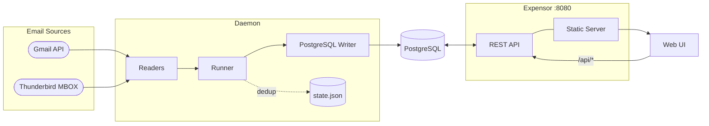

# Deployment & Release Overhaul — Design Spec

**Date:** 2026-04-04

---

## Goals

1. Single Docker image that bundles the Go backend + React frontend — users run one `docker compose up -d` and get a working app at `http://localhost:8080`
2. Nightly automated release that is smart about skipping days with no new commits
3. Unified `docker-compose.yml` at the root — reader selection is handled in the UI, no reader-specific compose files needed
4. Updated README: one-command quick start, Mermaid architecture diagram
5. Multi-arch images (linux/amd64, linux/arm64) — existing goal, maintained

---

## 1. Frontend bundled into the Docker image

### How

The Go server gains a static file handler: when `EXPENSOR_STATIC_DIR` is set (to `/app/public` in Docker), it serves files from that directory for all non-`/api` requests, falling back to `index.html` for SPA routing. When unset (local dev), the backend stays API-only and Vite's dev proxy handles the frontend.

**`backend/internal/api/server.go`** — `NewServer` accepts an optional `staticDir string`. When non-empty:

```go
// After registerRoutes(mux, handlers):
if staticDir != "" {
    mux.HandleFunc("/", spaHandler(staticDir))
}
```

```go
// spaHandler returns a handler that serves static files from dir and falls
// back to index.html for any path that does not resolve to a file.
func spaHandler(dir string) http.HandlerFunc {
    fs := http.FileServer(http.Dir(dir))
    return func(w http.ResponseWriter, r *http.Request) {
        path := filepath.Join(dir, filepath.Clean(r.URL.Path))
        if _, err := os.Stat(path); os.IsNotExist(err) {
            http.ServeFile(w, r, filepath.Join(dir, "index.html"))
            return
        }
        fs.ServeHTTP(w, r)
    }
}
```

`NewServer` gains a `staticDir string` parameter (passed from `main.go` via `envStr("EXPENSOR_STATIC_DIR", "")`). The EXPOSE comment in the Dockerfile becomes a real `EXPOSE 8080`.

### Updated Dockerfile

Multi-stage: Node.js → Go → runtime.

```dockerfile
# Stage 1: Build frontend
FROM node:22-alpine AS frontend-builder
WORKDIR /build/frontend
COPY frontend/package.json frontend/package-lock.json ./
RUN npm ci
COPY frontend/ .
RUN npm run build

# Stage 2: Build Go backend
FROM golang:1.26.1-alpine AS backend-builder
ARG TARGETOS
ARG TARGETARCH
ARG VERSION=dev
RUN apk add --no-cache git ca-certificates tzdata
WORKDIR /build/backend
COPY backend/go.mod backend/go.sum ./
RUN go mod download && go mod verify
COPY backend/ .
RUN CGO_ENABLED=0 GOOS=${TARGETOS:-linux} GOARCH=${TARGETARCH:-amd64} \
    go build -trimpath -ldflags="-s -w -X main.Version=${VERSION}" \
    -o expensor ./cmd/server

# Stage 3: Runtime
FROM alpine:3.23
RUN apk add --no-cache ca-certificates tzdata && update-ca-certificates
RUN addgroup -g 1000 expensor && adduser -D -u 1000 -G expensor expensor
WORKDIR /app
COPY --from=backend-builder /build/backend/expensor /app/expensor
COPY --from=frontend-builder /build/frontend/dist /app/public
RUN mkdir -p /app/data && chown -R expensor:expensor /app
USER expensor
EXPOSE 8080
ENV EXPENSOR_STATIC_DIR=/app/public
VOLUME ["/app/data"]
ENTRYPOINT ["/app/expensor"]
```

Note: `CMD ["run"]` is removed — the binary is a server started with no subcommands. Update the binary's main.go to not require a subcommand if it currently does.

---

## 2. Unified docker-compose.yml

Replace the three compose files (root `docker-compose.yml` + two under `deployment/`) with a single clean file at the project root. Reader selection happens in the UI after startup, so no reader-specific variants are needed. Thunderbird users add a volume override (commented out by default).

```yaml
# docker-compose.yml
# Expensor — start with: docker compose up -d
# Then open http://localhost:8080 and follow the onboarding wizard.

services:
  postgres:
    image: postgres:16-alpine
    restart: unless-stopped
    environment:
      POSTGRES_DB: expensor
      POSTGRES_USER: expensor
      POSTGRES_PASSWORD: expensor_password
    volumes:
      - postgres_data:/var/lib/postgresql/data
    healthcheck:
      test: ["CMD-SHELL", "pg_isready -U expensor"]
      interval: 10s
      timeout: 5s
      retries: 5

  expensor:
    image: ghcr.io/arionmiles/expensor:latest
    restart: unless-stopped
    depends_on:
      postgres:
        condition: service_healthy
    ports:
      - "8080:8080"
    environment:
      POSTGRES_HOST: postgres
      POSTGRES_PORT: 5432
      POSTGRES_DB: expensor
      POSTGRES_USER: expensor
      POSTGRES_PASSWORD: expensor_password
      POSTGRES_SSLMODE: disable
    volumes:
      - ./data:/app/data
      # Thunderbird only: uncomment and set path to your Thunderbird profile
      # - /path/to/Thunderbird/Profiles/your.profile:/thunderbird-profile:ro

volumes:
  postgres_data:
```

**Remove** `deployment/docker-compose.gmail-postgres.yml` and `deployment/docker-compose.thunderbird-postgres.yml` — both are replaced by the unified file above. The `deployment/` directory can be deleted.

---

## 3. Nightly release workflow

### Trigger and skip logic

Runs at 02:00 UTC daily (and on `workflow_dispatch` for manual runs). Skips if HEAD equals the commit the previous nightly was built from, preventing wasteful runs on inactive days.

Skip check: compare current HEAD SHA to the SHA stored in the `nightly` git tag (using `git rev-list -1 nightly`). If equal → set `skip=true` and exit early. If `nightly` tag doesn't exist → first nightly, proceed.

### Versioning

Nightly version string: `nightly-YYYYMMDD-<7-char-sha>` (e.g. `nightly-20260404-a1b2c3d`).

Tags applied:
- `nightly` — moving tag always pointing to the latest nightly build
- `nightly-YYYYMMDD` — dated tag for history

Docker image tags:
- `ghcr.io/arionmiles/expensor:nightly`
- `ghcr.io/arionmiles/expensor:nightly-YYYYMMDD`

### Jobs

The nightly workflow has three jobs identical in structure to the existing `release.yml`:
1. `check-changes` — determines skip/proceed; sets `has_changes` output
2. `build-docker` — builds multi-arch image, pushes to GHCR (only if `has_changes=true`)
3. `create-release` — creates/updates a GitHub pre-release named "Nightly" with the Docker pull command and changelog since previous nightly

Binaries are **not** published in nightly releases — Docker image only. Binary releases remain tag-triggered.

### Workflow skeleton

```yaml
name: Nightly

on:
  schedule:
    - cron: '0 2 * * *'
  workflow_dispatch: {}

jobs:
  check-changes:
    runs-on: ubuntu-latest
    outputs:
      has_changes: ${{ steps.diff.outputs.has_changes }}
      version: ${{ steps.ver.outputs.version }}
    steps:
      - uses: actions/checkout@v6
        with:
          fetch-depth: 0
          fetch-tags: true

      - name: Check for changes since last nightly
        id: diff
        run: |
          LAST=$(git rev-list -1 nightly 2>/dev/null || echo "none")
          CURRENT=$(git rev-parse HEAD)
          if [ "$LAST" = "$CURRENT" ]; then
            echo "has_changes=false" >> $GITHUB_OUTPUT
          else
            echo "has_changes=true" >> $GITHUB_OUTPUT
          fi

      - name: Compute version string
        id: ver
        run: |
          DATE=$(date -u +%Y%m%d)
          SHA=$(git rev-parse --short=7 HEAD)
          echo "version=nightly-${DATE}-${SHA}" >> $GITHUB_OUTPUT

  build-docker:
    needs: check-changes
    if: needs.check-changes.outputs.has_changes == 'true'
    runs-on: ubuntu-latest
    steps:
      - uses: actions/checkout@v6
      - uses: docker/setup-qemu-action@v3
      - uses: docker/setup-buildx-action@v3
      - uses: docker/login-action@v3
        with:
          registry: ghcr.io
          username: ${{ github.actor }}
          password: ${{ secrets.GITHUB_TOKEN }}
      - name: Build and push
        uses: docker/build-push-action@v6
        with:
          context: .
          platforms: linux/amd64,linux/arm64
          push: true
          tags: |
            ghcr.io/${{ github.repository }}:nightly
            ghcr.io/${{ github.repository }}:${{ needs.check-changes.outputs.version }}
          build-args: VERSION=${{ needs.check-changes.outputs.version }}
          cache-from: type=gha
          cache-to: type=gha,mode=max
          provenance: false
          sbom: false

      - name: Update nightly tag
        run: |
          git config user.email "actions@github.com"
          git config user.name "GitHub Actions"
          git tag -f nightly
          git push origin nightly --force

  create-release:
    needs: [check-changes, build-docker]
    if: needs.check-changes.outputs.has_changes == 'true'
    runs-on: ubuntu-latest
    permissions:
      contents: write
    steps:
      - uses: actions/checkout@v6
        with:
          fetch-depth: 0
          fetch-tags: true
      - name: Create/update nightly pre-release
        uses: softprops/action-gh-release@v2
        with:
          tag_name: nightly
          name: Nightly (${{ needs.check-changes.outputs.version }})
          prerelease: true
          body: |
            Latest automated nightly build.

            ## Docker
            ```bash
            docker pull ghcr.io/${{ github.repository }}:nightly
            ```

            **Version:** `${{ needs.check-changes.outputs.version }}`
        env:
          GITHUB_TOKEN: ${{ secrets.GITHUB_TOKEN }}
```

---

## 4. README updates

### Quick Start (replace current section)

```markdown
## Quick Start

```bash
# 1. Download the compose file
curl -O https://raw.githubusercontent.com/ArionMiles/expensor/main/docker-compose.yml

# 2. Start expensor and postgres
docker compose up -d

# 3. Open the web UI and follow the onboarding wizard
open http://localhost:8080
```

Your data is stored in `./data/` (created automatically).

### Releases

| Channel | Image tag | Updated |
|---|---|---|
| Stable | `ghcr.io/arionmiles/expensor:latest` | On git tag push |
| Nightly | `ghcr.io/arionmiles/expensor:nightly` | Daily (if changes exist) |
```

### Architecture diagram (replace ASCII art)

```markdown
## Architecture



---

## 5. Files changed / created / deleted

| File | Action | Notes |
|------|--------|-------|
| `Dockerfile` | Update | Add Node.js frontend build stage; real `EXPOSE 8080`; remove stale CMD |
| `docker-compose.yml` | Replace | Clean unified file using `ghcr.io` image |
| `deployment/docker-compose.gmail-postgres.yml` | Delete | Superseded |
| `deployment/docker-compose.thunderbird-postgres.yml` | Delete | Superseded |
| `backend/internal/api/server.go` | Modify | Add `staticDir` param; `spaHandler` |
| `backend/cmd/server/main.go` | Modify | Pass `EXPENSOR_STATIC_DIR` to `NewServer` |
| `.github/workflows/nightly.yml` | Create | New nightly build workflow |
| `README.md` | Update | Quick start, Mermaid diagram, release table |

---

## Out of scope (separate specs)

- **Starlight documentation site** — deferred until project is ready for broad sharing
- **Binary releases in nightly** — excluded by design; nightly is Docker-only
